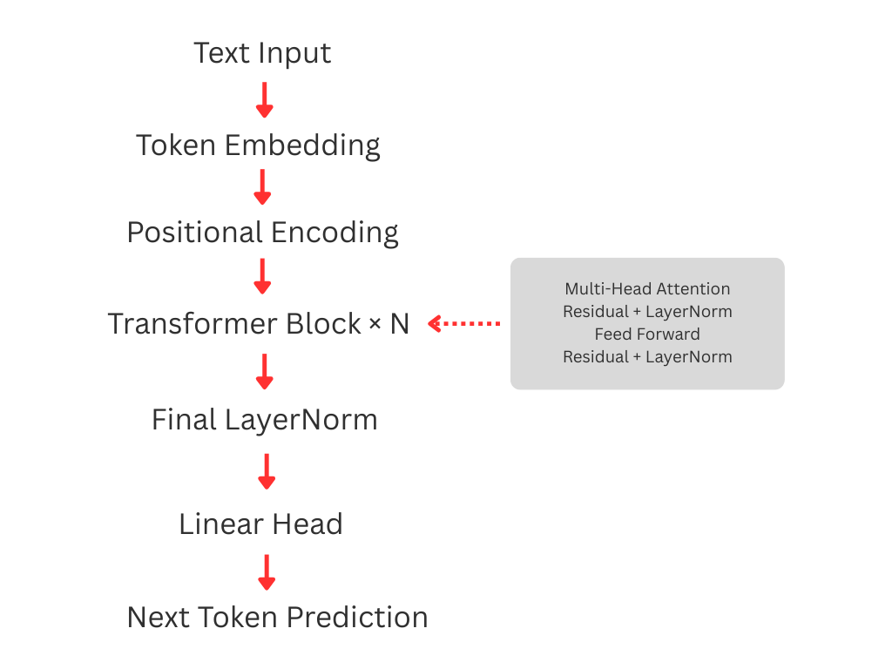

# Mini GPT — Transformer From Scratch


This project implements a **character-level GPT language model from scratch using PyTorch**.

The goal of this project was to deeply understand the internal mechanics of Large Language Models (LLMs) including:

- Token Embeddings
- Positional Encoding
- Multi-Head Self Attention
- Causal Masking
- Feed Forward Networks
- Residual Connections
- Layer Normalization
- Autoregressive Language Modeling
- Cross Entropy Training

The architecture follows the **Transformer decoder architecture used in GPT models**.

---

## Model Architecture

Input → Token Embedding  → Positional Encoding  → Transformer Blocks  

Each Transformer block contains:

- Multi-Head Self Attention
- Residual Connection
- LayerNorm
- Feed Forward Network
- Residual Connection
- LayerNorm

Final layer:

Linear projection → Vocabulary logits

Training objective:

Next character prediction using cross-entropy loss.



---

## Training

Dataset: Shakespeare text  
Tokenization: Character-level  

Example training progress:
```
step 0 loss 4.383574962615967
step 500 loss 2.0068559646606445
step 1000 loss 1.6972147226333618
........
```
## Sample Generated Text
```
First Citizen:
See where part, she would do not say'd us.

Second Messenger:
Look, indeed, ask my states! for the pity
Where is not be? then came after? O, good
```


## Project Highlights

• Implemented **Transformer decoder architecture from scratch**

• Built **Multi-Head Self Attention with causal masking**

• Implemented **sinusoidal positional encoding**

• Implemented **Feed Forward Networks + residual connections**

• Trained **autoregressive character-level GPT model**

• Achieved **training loss below 1.0**

• Generated Shakespeare-style dialogue


## Technologies Used

- Python
- PyTorch
- Transformer Architecture
- Autoregressive Language Modeling

---


## Learning Outcome

This project demonstrates a full implementation of the core components used in modern LLMs such as GPT-2 and GPT-3.

The implementation focuses on **understanding the mathematical and architectural foundations of Transformers** rather than using high-level libraries.

---

## How to Run

1. Clone the repository
```
git clone https://github.com/Thashmila-Dewmini/mini-GPT.git
cd mini-GPT
```

2. Create virtual environment
```
python -m venv venv
```

3. Activate environment
```
Windows:
venv\Scripts\activate

Mac/Linux:
source venv/bin/activate
```

4. Install dependencies
```
pip install -r requirements.txt
```

5. Train the model
```
python train.py
```

The model will start training and periodically print the loss and generated text.


## Future Improvements

- Subword tokenization (BPE)
- GPT-2 scaling
- Flash Attention
- Top-k / Top-p sampling
- Training on larger datasets


